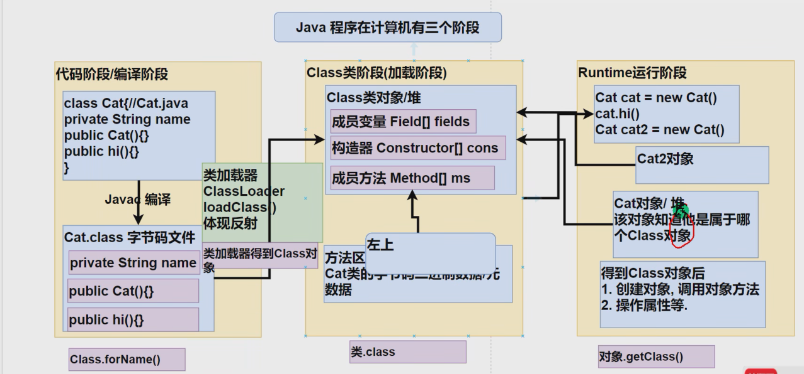
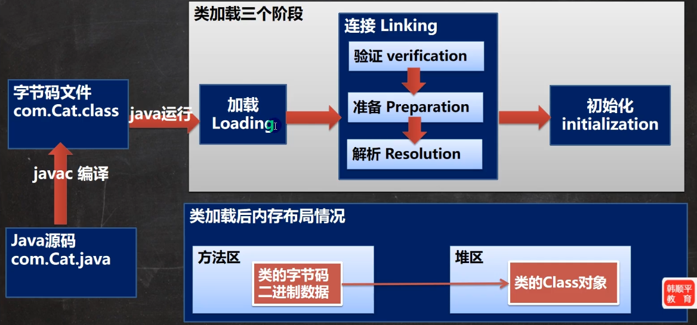

##反射
####反射作用

1. 在运行时分析类的能力,创建对象
2. 在运行时查看对象
3. 实现通用的数组操作代码
4. 利用Method对象,这个对象类似c++ 函数指针


#### Class 对象获取方式
1. 通过对象使用getClass()
2. 根据类型路径获取，Class.forName(ClassName) ClassName类全路径
3. 类型获取, T.class



#### 反射机制
```text
  加载完类后，在堆中产生一个Class 类型的对象（一个类只有一个Class对象），这个对象包含类的完整结构，可以通过Class类获取对象的类结构。
```


#### 反射优缺点
优点：
    1. 动态创建对象和使用对象，灵活
缺点
    1. 解释执行，执行速度有影响
优化方法：
    1. 设置反射取消执行访问检查
 
#### 类加载
1. 静态加载 编译加载检查，强依赖
2. 动态加载 运行执行，反射执行，降低依赖




```text
类加载-loading
    将字节码转二进制字节流加载到内存中，并形成类的Class 对象
类加载-linking-验证
    确保Class文件字节流中信息符合虚拟机要求，不会危害虚拟机安全，包含文件格式验证oxcafebabe 开头，元数据远征，字节码验证和符号引用验证，可以使用-Xverify:none 关闭验证
类加载-linking-准备
    JVM对静态变量，分配内存，并初始化默认值
类加载-linking-解析
    虚拟机将常量池中符号替换未直接引用的过程。加载前符号引用关联，加载到内存需要继续地址进行相互引用
类加载-初始化
    静态变量赋值语句和静态代码语句收集

注： 使用类的静态属性会导致类加载。类加载中加锁保证内存只有一份CLass对象
```


 
 
 
 
