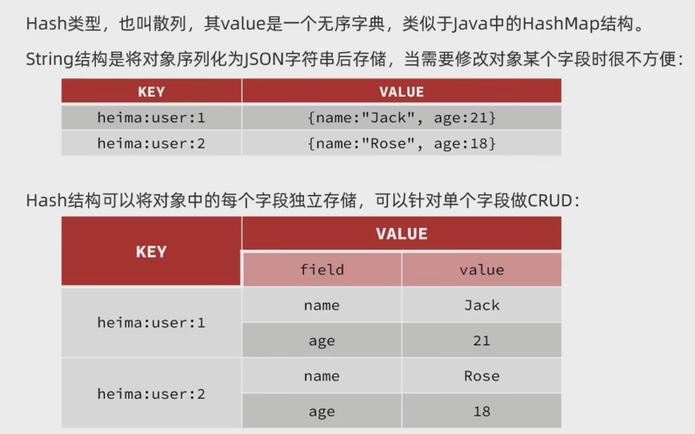

### Redis 通用命令
---
```
keys * 单线程，正式环境会阻塞，影响使用
del * 
exists *
expires *
```
### Redis 基础数据类型
---
+ String 
```
set 添加一个键值
get 根据key 获取值
MSET 批量添加
MGET 批量获取
INCR 自增，让一个key 对应整数value 进行自增
INCRBY key increment 指定增长步长
INCRBYFLOAT 浮点数指定步长增加
SETNX 添加一个String 类型键值对，前提key不存在，否则不执行
SETEX 添加一个String 类型键值，并指定有效期
```
+ Hash 类型(HashMap)

```
HSET key field value 添加或者修改hash类型key 的field 值
HGET key field 
HMSET 批量设置
HMGET 批量获取
HGETALL 获取一个hash 类型的所有field 和 value 
HKEYS 获取一个hash 类型中的field
HVALS 获取一个hash 类型所有value
HINCRBY 让一个hash 类型key 的字段进行指定步长的增长
HSETINX 添加一个hash 类型的key的field 值，存在不执行
```
+ LIST 类型(LinkList )
Redis List类型可以看成双向链表结构。有序、元素可以重复、插入与删除块、查询速度一般。
```
LPUSH key element 向列表左侧插入一个多个元素
LPOP key 移除并返回左侧第一个元素,没有返回null
RPUSH key element 向列表右侧插入一个或者多个元素
RPOP key 移除并返回右侧第一个元素,没有返回null
LRANGE key star end 返回一段角标范围内的元素
BLPOP BRPOP 在没有移除元素时等待指定的时间,阻塞等待获取
```
+ SET 类型(HashSet)
Redis Set 类型堪称value 为null 的HashMap。无序、元素不可以重复、查找快、支持交集、并集、差集功能。
```
SADD key member 向set 添加一个或者多个元素
SREM key member 移除set 中指定元素
SCARD key 返回set 中元素的个数
SISMEMBER key member 判断一个元素是否存在set中
SMEMBERS 获取set 中所有元素
```
+ SortSet 类型 (与java 中TreeSet相似)
Redis SortSet 可以排序的set 集合。与 Java 中treeSet 类型，但底层实现方式不同。 SortSet 中的每一个元素带有一个score 属性。 可以基于score 属相对元素进行排序，底层实现是一个跳标(skipList)加hash标。可以排序、元素不重复、查询速度快。常用于排行榜的功能。
```
ZADD key score member 添加一个或者多个元素到sorted set ,存在更新
ZREM key member 删除sorted set 中的执行元素
ZSCORE key member 获取指定sorted set 元素的score值
ZRANK key member 获取指定sorted set 元素的排名
ZCARD key 获取sorted set 的元素个数
ZCOUNT key min max 统计score 范围内的元素个数
ZINCRBY key increment member 让sorted set 指定元素自增，步长为increment
ZRANGE key min max score排序后，获取指定排名范围内的元素
ZRANGEBYSCORE key min max 按照score 排序，获取指定score 范围中的元素
ZDIFF、ZINTER、ZUNION 求差、交、并集
```